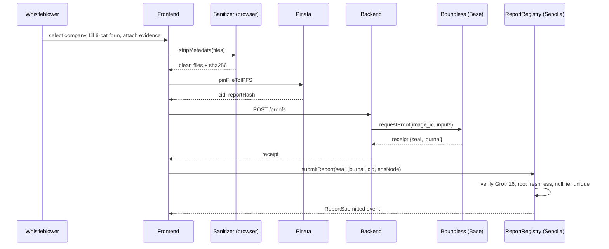

<aside>
🔒

**Status:** Locked. Canonical Phase 1 spine.

**Owner:** Anoushk (Tech Lead) · **Team:** Agent A (Core/Contracts) · Agent B (ZK & Backend) · Agent C (Client/UI)

**Target:** Sepolia · ETHPrague 2026 · 48–72h

**Origin:** Doc A [Phase 1 — Architecture & API Contract](https://www.notion.so/Phase-1-Architecture-API-Contract-7db84dc58e9c4673ae460b155a831b31?pvs=21) as spine, with four grafts from Doc B [Phase 1 — Foundation & API Contract](https://www.notion.so/Phase-1-Foundation-API-Contract-beb4d59134714ae697d3767591052e74?pvs=21): bounty matrix (§0), `no-hardcoded-eth-addresses` ESLint rule, ENSIP-10 wildcard promoted, X402 stub pre-wired.

</aside>

## Locked decisions (8 May)

| Decision | Choice | Implication |
| --- | --- | --- |
| SpaceComputer | **Dropped entirely** | Period seed = `keccak256(ensNode || floor(ts / QUARTER))`. Stretch slot freed. |
| Proving backend | **Boundless on Base** | Path A: receipt verified directly on Sepolia verifier. No bridge. |
| ENS | **Real Sepolia only** | No mock fallback on the demo branch. Read via `eth_call`, cache 30s. Need to claim `shieldpass.eth` (or similar) on Sepolia. |
| CCIP-Read gateway | **Deferred to v2** | Out of scope for 72h. Wildcard resolver only. |
| Ops agents / CLI | **Deferred to v2** | Umia framing handled in pitch deck only. |
| X402 / Context Pack | **Stretch, but pre-wired** | OpenAPI defines the 402 response shape now; stub endpoint ships in Phase 1. Real payment flow only if core is green by Saturday afternoon. |

# 0. Bounty alignment matrix

Every architectural decision below is anchored to at least one judging criterion. If a feature does not map to a row here, it does not belong in core scope.

| **Bounty** | **Hard requirement** | **Where it lives** |
| --- | --- | --- |
| ENS B2 — Creative Use *(primary)* | ENS does work beyond name→address. Subnames as access tokens. | §3 Identity layer, §4.4 ENS records, `ShieldPassResolver.sol` with ENSIP-10 wildcard |
| ENS B2 | **No hard-coded values.** Resolution must be live. | §7 cross-cutting rule + custom ESLint rule `no-hardcoded-eth-addresses` in CI |
| ENS B2 | Text records are public — no secrets. | §4.4 records are commitments only; sensitive per-subname history is local-DB-only in v1 |
| ENS B2 | Technical depth: resolvers, records, wildcard. | ENSIP-10 wildcard for `worker-*.acme.eth`; subname tree pattern |
| Privacy by Design | Identity privacy by construction. | ZK badge-membership proof + nullifier; client-side EXIF/PDF metadata stripping before IPFS upload |
| Apify X402 *(stretch)* | Real X402 payment, agent-to-agent. | `/v1/reports/{id}/contextPack` returns 402 + X402 challenge; happy path scripted in `infra/e2e.ts` only if core ships first |
| Umia *(stretch, pitch-only)* | Agentic workflow + path to revenue. | Per-Context-Pack X402 fee documented in pitch deck. No CLI / agents code in v1. |

# 1. Resource Compatibility Check

| Resource | Used for | Status | Notes |
| --- | --- | --- | --- |
| RISC Zero zkVM 3.x (`risc0-zkvm`) | Badge-membership + nullifier proof | ✅ | Pin to **release-3.0** of `risc0-ethereum`. `main` is dev-only. |
| Boundless prover marketplace | Off-device proof generation | ✅ | Lives on **Base**. Submit on Base, verify on Sepolia. Budget ~$5 in Base ETH. |
| `IRiscZeroVerifier.sol` on Sepolia | On-chain Groth16 verify | ✅ | Pre-deployed. Pull address from RISC Zero registry. Do **not** redeploy. |
| RISC Zero Steel | EVM state proofs | ⚠️ | Skip for v1. |
| ENS PublicResolver + ENSIP-5 | Text records on parent | ✅ | Stable. |
| ENSIP-10 wildcard | Pseudonymous subnames without per-name gas | ✅ | **Custom resolver** — `PublicResolver` doesn't support wildcard. |
| CCIP-Read (ERC-3668) | Off-chain subname tree | ⚠️ | Deferred to v2. |
| Pinata IPFS | Report + evidence storage | ✅ | JWT auth. `pinJSONToIPFS` capped at **10MB** — keep JSON small. |
| `exifr` | Browser EXIF stripping | ✅ | Re-encode via `<canvas>` to produce a clean copy. |
| `pdf-lib` | PDF metadata stripping | ✅ | Strips Info dict only. **Must also overwrite XMP stream**, re-save with `useObjectStreams:false`. |
| wagmi v2 + viem 2.x | Wallet/contract | ✅ | `create-wagmi`, TanStack Query 5. |
| Apify X402 | Stretch: Context Pack | 🟡 | Conditional only. |
| SpaceComputer KMS | — | ❌ | Not GA. Dropped. |

## 🚩 Critical flags carried forward

1. Boundless market is on Base — proofs generated there, but Groth16 receipts verify on **any** chain that has an `IRiscZeroVerifier` with the same `imageId` (Path A). No bridge.
2. Sepolia ENS subgraph latency is the single biggest demo failure mode → read roots via `eth_call`, cache 30s, pre-warm before pitch.
3. PDF XMP streams survive naive `pdf-lib` strips → sanitizer needs explicit XMP overwrite pass.
4. Office docs out-of-scope; UI must warn user to export to PDF first.

# 2. System Architecture & Scaffolding

## 2.1 Tech stack

| Layer | Tech |
| --- | --- |
| Smart contracts | Solidity 0.8.26, Foundry, OpenZeppelin (Merkle), `risc0-ethereum` v3 verifier |
| ZK circuit | Rust, `risc0-zkvm` 3.0, Poseidon hash |
| Proof orchestration | Node.js 20 + TypeScript, Boundless SDK adapter (with local cargo fallback) |
| Storage | Pinata IPFS (REST) |
| Frontend | Vite + React 18 + TypeScript, wagmi v2, viem 2.x, TanStack Query 5, Tailwind |
| Indexer | viem `watchEvent` → SQLite (`better-sqlite3`) |
| Sanitization | `exifr`, `pdf-lib`, browser-only |
| Lint | ESLint + custom rule `no-hardcoded-eth-addresses` (ENS B2) |

## 2.2 Submission data flow



## 2.3 Repository layout (pnpm monorepo)

```
shieldpass/
├── pnpm-workspace.yaml
├── package.json
├── .github/workflows/
│   ├── ci.yml
│   └── lint-no-hardcode.yml      # fails build on ETH addr / root literal in apps/**
├── packages/
│   ├── contracts/                # Agent A
│   │   ├── foundry.toml
│   │   ├── src/
│   │   │   ├── CompanyRegistry.sol
│   │   │   ├── BadgeTreeManager.sol
│   │   │   ├── ReportRegistry.sol
│   │   │   ├── ShieldPassResolver.sol     # ENSIP-10 wildcard
│   │   │   ├── interfaces/
│   │   │   └── libraries/PoseidonT3.sol
│   │   ├── script/{Deploy,SeedDemo}.s.sol
│   │   └── test/
│   ├── zk/                       # Agent B
│   │   ├── methods/{guest,src}
│   │   └── host/                 # local cargo fallback CLI
│   ├── backend/                  # Agent B
│   │   ├── openapi.yaml          # ⇽ THE CONTRACT
│   │   └── src/
│   │       ├── server.ts
│   │       ├── routes/{proofs,reports,companies,ipfs,contextPack}.ts
│   │       └── services/{proverClient,ipfsClient,ensReader,indexer}.ts
│   ├── shared/                   # All agents
│   │   ├── src/{api,enums,chain,abis}.ts
│   │   └── eslint-rules/no-hardcoded-eth-addresses.cjs
│   └── frontend/                 # Agent C
│       └── src/
│           ├── pages/{Submit,Feed,ReportDetail,CompanyAdmin}.tsx
│           ├── components/
│           ├── lib/sanitize/{exif,pdf}.ts
│           ├── lib/ens-live.ts   # viem readContract; throws on hardcoded args
│           └── hooks/
└── infra/
    ├── docker-compose.yml
    ├── e2e.ts                    # full happy-path script
    └── env/.env.example
```

## 2.4 Branching

- `main` — protected. Owns `packages/backend/openapi.yaml`, `packages/shared`, root configs.
- `feature/core-contracts` → Agent A
- `feature/zk-backend` → Agent B
- `feature/client-interface` → Agent C
- All PRs: `forge test`, `cargo test`, `vitest`, `openapi diff` against `packages/backend/openapi.yaml`, `lint-no-hardcode`.
- `packages/shared` is **jointly owned**; changes need a `shared:`-labeled 1-line PR with instant Tech-Lead review.

# 3. Shared Data Models

## 3.1 On-chain (Solidity)

```solidity
struct Company {
    bytes32 ensNode;
    address admin;
    bool    active;
    uint64  registeredAt;
}

struct RootEntry { bytes32 root; uint64 setAt; }
// ROOT_HISTORY_DEPTH = 8, FRESHNESS_SECONDS = 7 days

enum ReportCategory {
    Misconduct,             // 0
    SelectiveDisclosure,    // 1
    Misclassification,      // 2
    HollowPromise,          // 3
    InNameOnly,             // 4
    MisleadingPresentation  // 5
}

struct Report {
    bytes32 ensNode;
    bytes32 reportHash;
    bytes32 nullifier;
    bytes32 rootUsed;
    string  cid;
    ReportCategory category;
    uint64  submittedAt;
    bytes32 pseudonymNode;
}
```

Resolver text-record keys (ENSIP-5), all read live (no hardcoded values in `apps/**`):

- Parent (e.g. `acme.eth`):
    - `shieldpass.badge-tree-root`
    - `shieldpass.badge-tree-history` (JSON array)
    - `shieldpass.report-policy`
    - `shieldpass.attestation-issuer`
    - `shieldpass.registry` (ReportRegistry contract address)
- Subname (e.g. `worker-7f3a.acme.eth`, served via ENSIP-10 wildcard):
    - `shieldpass.zk-credential` (commitment to badge leaf, **not** the badge itself)
    - `shieldpass.reports-submitted` (count)

## 3.2 ZK journal (public outputs)

```rust
#[derive(Serialize, Deserialize)]
pub struct Journal {
    pub root: [u8; 32],
    pub report_hash: [u8; 32],
    pub nullifier: [u8; 32],
    pub period_id: u64,
    pub ens_node: [u8; 32],
}
```

## 3.3 IPFS report payload (canonicalized JSON)

```json
{
  "$schema": "https://shieldpass.xyz/schemas/report-v1.json",
  "version": 1,
  "company": { "ensName": "acme.eth", "ensNode": "0x..." },
  "category": "Misclassification",
  "title": "Gas investments booked under Renewables line item",
  "summary": "Plain-language summary, ≤ 1000 chars.",
  "structuredFields": {
    "claim": "...",
    "reality": "...",
    "evidenceRefs": ["ipfs://bafy.../q3-internal.pdf"],
    "publicSourceRefs": ["https://acme.com/sustainability-2025.pdf"],
    "incidentDate": "2025-09-01",
    "severity": "high"
  },
  "evidence": [
    {
      "cid": "bafy...",
      "filename": "q3-internal-redacted.pdf",
      "mime": "application/pdf",
      "sha256": "0x...",
      "sanitized": { "tool": "pdf-lib+xmp-strip", "version": "1.0.0" }
    }
  ],
  "submittedAt": "2026-05-08T15:00:00Z",
  "pseudonym": "worker-7f3a.acme.eth"
}
```

## 3.4 Backend SQLite (read model — chain is source of truth)

```sql
CREATE TABLE companies (
  ens_node TEXT PRIMARY KEY,
  ens_name TEXT NOT NULL,
  admin TEXT NOT NULL,
  active INTEGER NOT NULL DEFAULT 1,
  registered_at INTEGER NOT NULL
);
CREATE TABLE root_history (
  ens_node TEXT NOT NULL,
  root TEXT NOT NULL,
  set_at INTEGER NOT NULL,
  PRIMARY KEY (ens_node, root)
);
CREATE TABLE reports (
  report_hash TEXT PRIMARY KEY,
  ens_node TEXT NOT NULL,
  nullifier TEXT NOT NULL UNIQUE,
  root_used TEXT NOT NULL,
  cid TEXT NOT NULL,
  category INTEGER NOT NULL,
  submitted_at INTEGER NOT NULL,
  pseudonym_node TEXT NOT NULL,
  tx_hash TEXT NOT NULL,
  block_number INTEGER NOT NULL,
  context_pack_cid TEXT,
  context_pack_paid_by TEXT
);
CREATE INDEX idx_reports_company ON reports(ens_node, submitted_at DESC);
CREATE INDEX idx_reports_category ON reports(category, submitted_at DESC);
CREATE TABLE pseudonym_stats (
  pseudonym_node TEXT PRIMARY KEY,
  reports_count INTEGER NOT NULL DEFAULT 0,
  verified_count INTEGER NOT NULL DEFAULT 0,
  debunked_count INTEGER NOT NULL DEFAULT 0
);
```

# 4. Common API Contract (OpenAPI 3.1)

<aside>
⚠️

**No agent may deviate from this contract.** TypeScript types in `packages/shared/src/api.ts` are generated from `packages/backend/openapi.yaml` via `openapi-typescript`. Frontend mocks must match exactly.

</aside>

```yaml
openapi: 3.1.0
info:
  title: ShieldPass Backend API
  version: 1.0.0
servers:
  - url: http://localhost:8787/v1
  - url: https://api.shieldpass.xyz/v1

components:
  schemas:
    Hex32: { type: string, pattern: "^0x[0-9a-fA-F]{64}$" }
    Address: { type: string, pattern: "^0x[0-9a-fA-F]{40}$" }
    EnsName: { type: string, pattern: "^[a-z0-9-]+(\\.[a-z0-9-]+)+$" }
    Cid: { type: string, pattern: "^(bafy|Qm)[A-Za-z0-9]+$" }

    ReportCategory:
      type: string
      enum: [Misconduct, SelectiveDisclosure, Misclassification, HollowPromise, InNameOnly, MisleadingPresentation]

    Company:
      type: object
      required: [ensName, ensNode, admin, active, badgeTreeRoot, registeredAt]
      properties:
        ensName: { $ref: "#/components/schemas/EnsName" }
        ensNode: { $ref: "#/components/schemas/Hex32" }
        admin: { $ref: "#/components/schemas/Address" }
        active: { type: boolean }
        badgeTreeRoot: { $ref: "#/components/schemas/Hex32" }
        rootHistory: { type: array, items: { $ref: "#/components/schemas/Hex32" } }
        registeredAt: { type: integer, format: int64 }

    EvidenceItem:
      type: object
      required: [cid, filename, mime, sha256]
      properties:
        cid: { $ref: "#/components/schemas/Cid" }
        filename: { type: string }
        mime: { type: string }
        sha256: { $ref: "#/components/schemas/Hex32" }
        sanitized:
          type: object
          properties: { tool: { type: string }, version: { type: string } }

    ReportPayload:
      type: object
      required: [version, company, category, title, summary, structuredFields, evidence, submittedAt, pseudonym]
      properties:
        version: { type: integer, const: 1 }
        company:
          type: object
          required: [ensName, ensNode]
          properties:
            ensName: { $ref: "#/components/schemas/EnsName" }
            ensNode: { $ref: "#/components/schemas/Hex32" }
        category: { $ref: "#/components/schemas/ReportCategory" }
        title: { type: string, maxLength: 200 }
        summary: { type: string, maxLength: 1000 }
        structuredFields: { type: object, additionalProperties: true }
        evidence: { type: array, items: { $ref: "#/components/schemas/EvidenceItem" } }
        submittedAt: { type: string, format: date-time }
        pseudonym: { $ref: "#/components/schemas/EnsName" }

    ProofRequest:
      type: object
      required: [sealedBadge, ensNode, reportHash, periodId]
      properties:
        sealedBadge: { type: string }
        ensNode: { $ref: "#/components/schemas/Hex32" }
        reportHash: { $ref: "#/components/schemas/Hex32" }
        periodId: { type: integer, format: int64 }

    ProofReceipt:
      type: object
      required: [seal, journal, imageId]
      properties:
        seal: { type: string }
        imageId: { $ref: "#/components/schemas/Hex32" }
        journal:
          type: object
          required: [root, reportHash, nullifier, periodId, ensNode]
          properties:
            root: { $ref: "#/components/schemas/Hex32" }
            reportHash: { $ref: "#/components/schemas/Hex32" }
            nullifier: { $ref: "#/components/schemas/Hex32" }
            periodId: { type: integer, format: int64 }
            ensNode: { $ref: "#/components/schemas/Hex32" }

    Report:
      type: object
      required: [reportHash, ensNode, nullifier, rootUsed, cid, category, submittedAt, pseudonymNode, txHash, blockNumber]
      properties:
        reportHash: { $ref: "#/components/schemas/Hex32" }
        ensNode: { $ref: "#/components/schemas/Hex32" }
        nullifier: { $ref: "#/components/schemas/Hex32" }
        rootUsed: { $ref: "#/components/schemas/Hex32" }
        cid: { $ref: "#/components/schemas/Cid" }
        category: { $ref: "#/components/schemas/ReportCategory" }
        submittedAt: { type: integer, format: int64 }
        pseudonymNode: { $ref: "#/components/schemas/Hex32" }
        txHash: { $ref: "#/components/schemas/Hex32" }
        blockNumber: { type: integer, format: int64 }
        payload: { $ref: "#/components/schemas/ReportPayload" }
        contextPackCid: { type: string, nullable: true }

    PinResult:
      type: object
      required: [cid, size]
      properties:
        cid: { $ref: "#/components/schemas/Cid" }
        size: { type: integer }

    X402Challenge:
      type: object
      required: [scheme, network, asset, amount, recipient, resource, validUntil]
      properties:
        scheme: { type: string, example: 'exact' }
        network: { type: string, example: 'base-sepolia' }
        asset: { type: string }
        amount: { type: string }
        recipient: { type: string }
        resource: { type: string }
        validUntil: { type: string, format: date-time }

    Error:
      type: object
      required: [code, message]
      properties:
        code: { type: string }
        message: { type: string }
        details: { type: object, additionalProperties: true }

paths:
  /healthz:
    get: { summary: Liveness, responses: { "200": { description: OK } } }

  /companies:
    get:
      summary: List companies
      parameters:
        - { in: query, name: limit, schema: { type: integer, default: 50, maximum: 200 } }
        - { in: query, name: cursor, schema: { type: string } }
      responses:
        "200":
          description: OK
          content:
            application/json:
              schema:
                type: object
                required: [items]
                properties:
                  items: { type: array, items: { $ref: "#/components/schemas/Company" } }
                  nextCursor: { type: string, nullable: true }

  /companies/{ensName}:
    get:
      parameters: [{ in: path, name: ensName, required: true, schema: { $ref: "#/components/schemas/EnsName" } }]
      responses:
        "200": { description: OK, content: { application/json: { schema: { $ref: "#/components/schemas/Company" } } } }
        "404": { description: Not found }

  /ipfs/pin:
    post:
      summary: Pin sanitized file to IPFS
      requestBody:
        required: true
        content:
          multipart/form-data:
            schema:
              type: object
              required: [file]
              properties:
                file: { type: string, format: binary }
                filename: { type: string }
      responses:
        "200": { description: OK, content: { application/json: { schema: { $ref: "#/components/schemas/PinResult" } } } }

  /ipfs/pin-json:
    post:
      summary: Pin canonicalized report JSON
      requestBody:
        required: true
        content:
          application/json:
            schema: { $ref: "#/components/schemas/ReportPayload" }
      responses:
        "200":
          description: OK
          content:
            application/json:
              schema:
                type: object
                required: [cid, reportHash]
                properties:
                  cid: { $ref: "#/components/schemas/Cid" }
                  reportHash: { $ref: "#/components/schemas/Hex32" }

  /proofs:
    post:
      summary: Generate Boundless proof
      requestBody:
        required: true
        content: { application/json: { schema: { $ref: "#/components/schemas/ProofRequest" } } }
      responses:
        "200": { description: OK, content: { application/json: { schema: { $ref: "#/components/schemas/ProofReceipt" } } } }

  /reports:
    get:
      summary: Public feed
      parameters:
        - { in: query, name: company, schema: { $ref: "#/components/schemas/EnsName" } }
        - { in: query, name: category, schema: { $ref: "#/components/schemas/ReportCategory" } }
        - { in: query, name: since, schema: { type: integer, format: int64 } }
        - { in: query, name: limit, schema: { type: integer, default: 25, maximum: 100 } }
        - { in: query, name: cursor, schema: { type: string } }
      responses:
        "200":
          description: OK
          content:
            application/json:
              schema:
                type: object
                required: [items]
                properties:
                  items: { type: array, items: { $ref: "#/components/schemas/Report" } }
                  nextCursor: { type: string, nullable: true }

  /reports/{reportHash}:
    get:
      parameters: [{ in: path, name: reportHash, required: true, schema: { $ref: "#/components/schemas/Hex32" } }]
      responses:
        "200": { description: OK, content: { application/json: { schema: { $ref: "#/components/schemas/Report" } } } }
        "404": { description: Not found }

  /reports/{reportHash}/contextPack:
    post:
      summary: "Stretch (Apify X402). Pre-wired stub. First call returns 402; second call with X-PAYMENT runs Apify Actor."
      parameters: [{ in: path, name: reportHash, required: true, schema: { $ref: "#/components/schemas/Hex32" } }]
      responses:
        "402":
          description: payment required (X402)
          headers:
            X-PAYMENT-REQUIRED: { schema: { type: string }, description: 'Base64 X402 challenge' }
          content: { application/json: { schema: { $ref: "#/components/schemas/X402Challenge" } } }
        "202":
          description: enrichment scheduled
          content:
            application/json:
              schema:
                type: object
                required: [contextPackCid]
                properties: { contextPackCid: { type: string } }

  /pseudonyms/{pseudonymNode}/stats:
    get:
      parameters: [{ in: path, name: pseudonymNode, required: true, schema: { $ref: "#/components/schemas/Hex32" } }]
      responses:
        "200":
          description: OK
          content:
            application/json:
              schema:
                type: object
                required: [pseudonymNode, reportsCount, verifiedCount, debunkedCount]
                properties:
                  pseudonymNode: { $ref: "#/components/schemas/Hex32" }
                  reportsCount: { type: integer }
                  verifiedCount: { type: integer }
                  debunkedCount: { type: integer }
```

## 4.1 Error code registry

| Code | HTTP | Meaning |
| --- | --- | --- |
| `BAD_INPUT` | 400 | Schema validation failed |
| `INVALID_MERKLE_PATH` | 422 | Badge not in committed tree |
| `STALE_ROOT` | 422 | Root outside freshness window |
| `NULLIFIER_USED` | 409 | Replay / spam attempt |
| `IPFS_PIN_FAILED` | 502 | Pinata upstream error |
| `PROVER_TIMEOUT` | 504 | Proof > 90 s |
| `RATE_LIMITED` | 429 | 10/min on /proofs |
| `PAYMENT_REQUIRED` | 402 | X402 challenge issued (Context Pack stretch) |
| `PAYMENT_INVALID` | 402 | X-PAYMENT header rejected |
| `INTERNAL` | 500 | Catch-all |

## 4.2 On-chain function surface

```solidity
interface IReportRegistry {
    event ReportSubmitted(
        bytes32 indexed ensNode,
        bytes32 indexed reportHash,
        bytes32 nullifier,
        bytes32 rootUsed,
        uint8   category,
        bytes32 pseudonymNode,
        string  cid
    );
    function submitReport(
        bytes calldata seal,
        bytes32 root,
        bytes32 reportHash,
        bytes32 nullifier,
        uint64  periodId,
        bytes32 ensNode,
        uint8   category,
        bytes32 pseudonymNode,
        string calldata cid
    ) external;
    function isNullifierUsed(bytes32 n) external view returns (bool);
}

interface IBadgeTreeManager {
    event RootRotated(bytes32 indexed ensNode, bytes32 newRoot, bytes32 prevRoot);
    function rotateRoot(bytes32 ensNode, bytes32 newRoot) external;
    function isRootFresh(bytes32 ensNode, bytes32 root) external view returns (bool);
}

interface ICompanyRegistry {
    event CompanyRegistered(bytes32 indexed ensNode, address admin);
    function register(bytes32 ensNode, address admin) external;
    function isActive(bytes32 ensNode) external view returns (bool);
}
```

# 5. Cross-cutting conventions (locked)

- **Hash domain separation:** `reportHash = keccak256("SHIELDPASS_REPORT_v1" || ensNode || category || severity || contentSha256)`.
- **Nullifier:** `nullifier = poseidon(badge, periodId)` inside the guest program; `periodId = floor(unixTime / QUARTER)`.
- **Freshness window:** `ReportRegistry` accepts any root in the last 8 published roots.
- **No hardcoded ENS values (ENS B2 hard requirement):** ETH addresses, ENS names, namehashes, and Merkle roots may not appear as string literals in `apps/**` or `packages/frontend/**`. CI runs `lint-no-hardcode` which fails the build on violation. Resolution always goes through `packages/shared` ENS helpers.
- **No secrets in ENS text records:** records hold commitments and pointers only.
- **X402 contract (stretch):** `/v1/reports/{id}/contextPack` MUST issue a real X402 challenge on the first call and only run the Apify Actor after a verified `X-PAYMENT` header. Mocking the payment is not acceptable for the bounty demo. In Phase 1 this is a stub returning 402 with a static challenge.
- **Live ENS demo rule:** the demo branch runs against real Sepolia ENS. `MOCK_ENS=1` is allowed only in local dev and is rejected by CI on `main`.
- **Time:** API responses use ISO-8601 UTC. Frontend converts to `Europe/Prague` for display.
- **Logging:** structured JSON, never log `badge`, `nullifier_seed`, `merkle_path`, or raw evidence.
- **Commit convention:** Conventional Commits (`feat(scope): …`). Scope is one of `contracts`, `zk`, `backend`, `frontend`, `shared`, `infra`.
- **Testing baseline:** Foundry unit + invariant tests for contracts; Vitest for `backend` and `frontend`; one end-to-end happy-path script in `infra/e2e.ts`.

# 6. Phase 1 acceptance gate

Before Phase 2 begins, all three agents confirm:

- [ ]  `packages/shared` builds locally (`pnpm -w build`).
- [ ]  `openapi.yaml` is on `main` and `openapi-typescript` generation works.
- [ ]  Stub ABI JSONs for `CompanyRegistry`, `BadgeTreeManager`, `ReportRegistry`, `ShieldPassResolver` are in `packages/shared/src/abis/`.
- [ ]  Sepolia RPC + RISC Zero verifier address + Pinata JWT + Boundless config in `infra/env/.env.example`.
- [ ]  Sepolia ENS parent name claimed (`shieldpass.eth` or similar) — **owner: Anoushk**.
- [ ]  Base ETH funded (~$5) for Boundless requests — **owner: Anoushk**.
- [ ]  `lint-no-hardcode` ESLint rule active in CI.
- [ ]  `feature/core-contracts`, `feature/zk-backend`, `feature/client-interface` branches cut from the same `main` SHA.

# 7. Stretch posture

| Stretch | Status | Trigger |
| --- | --- | --- |
| SpaceComputer | ❌ Dropped | — |
| Apify X402 / Context Pack | 🟡 Pre-wired stub in OpenAPI; real flow conditional | Core green by Saturday afternoon |
| Umia agentic venture framing | 🟢 Pitch-only, no dev cost | Felix drafts in parallel |
| Ops agents / CLI | ❌ Dropped from v1 | — |
| CCIP-Read offchain subname tree | ❌ Deferred to v2 | — |

<aside>
➡️

Next: **Phase 2 — Agent Assignments & Parallel Implementation Plan**, sibling page under ShieldPass.

</aside>